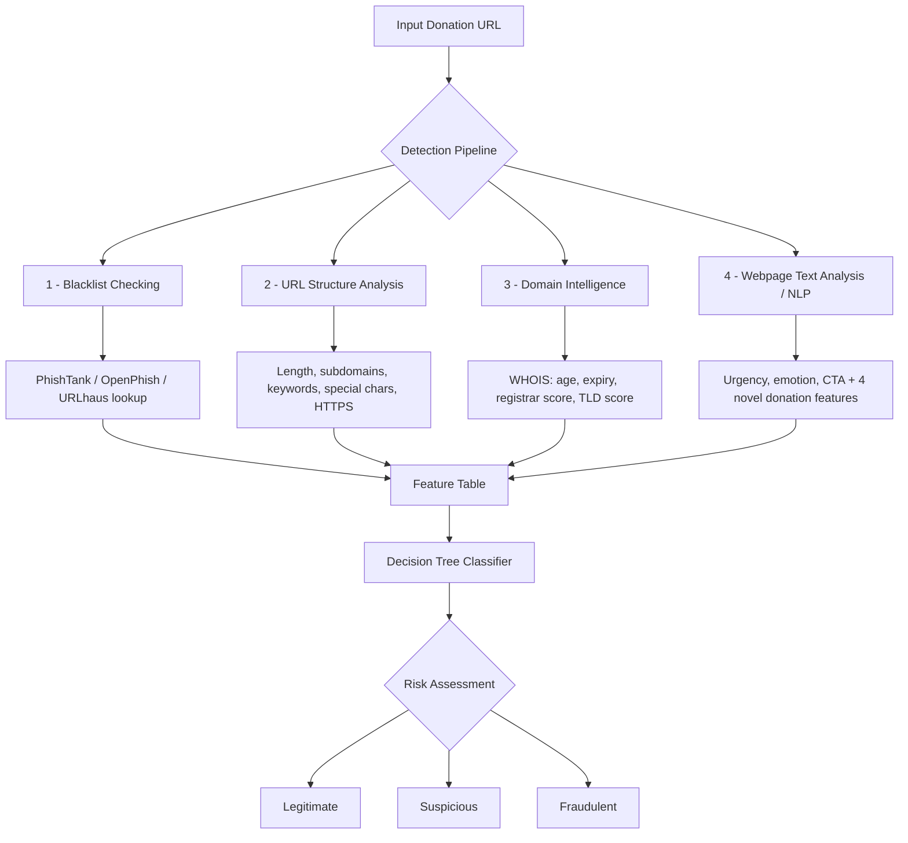

# Fraudulent Donation Link Detection Using AI

## Overview

With the rise of global humanitarian crises, natural disasters, and emergency fundraising campaigns, many individuals turn to online platforms to donate and support affected communities. Unfortunately, cybercriminals often exploit public trust by creating fraudulent donation websites and malicious donation links that impersonate legitimate charities or use emotional manipulation to deceive donors.

This project develops a **hybrid AI-based fraud detection system** capable of identifying potentially fraudulent donation links through a combination of reputation analysis, URL structure analysis, domain intelligence, webpage content analysis, and machine learning techniques.

The system provides an **interpretable risk assessment** that helps users determine whether a donation link is likely to be legitimate, suspicious, or fraudulent.

---

## Research Contribution

Existing phishing detectors are largely **domain-agnostic**. The genuine novelty of this project lies in **four donation-specific features** that are absent from prior phishing-detection literature:

1. **Emotional-pressure / cause-urgency language detection** — measures manipulative fundraising language.
2. **Charity registration and tax-ID presence detection** — checks for legitimate registration signals on the page.
3. **Registrant-to-claimed-cause consistency (impersonation check)** — compares the domain registrant against the claimed charity to catch look-alikes.
4. **Payment-pathway type classification** — classifies the requested payment method (gift card, crypto, wire, personal account vs. vetted processor).

Standard lexical, URL-structure, and WHOIS/registrar features are treated as an **established baseline** (with citations), not as novel contributions. The four features above are the core research contribution.

---

## System Architecture



---

## Objectives

- Detect fraudulent donation links using a multi-layered detection framework.
- Extract meaningful structural, temporal, and textual features from donation URLs and webpages.
- Analyze domain-related metadata such as domain age, registrar reputation, and TLD risk.
- Identify suspicious patterns commonly found in scam donation campaigns.
- Train an interpretable machine learning model to classify donation links.
- Generate explainable risk scores and classifications.
- Evaluate detection performance using cross-validation and standard machine learning metrics.

---

## Detection Pipeline

The system evaluates a given URL using four primary analysis modules.

### 1. Blacklist Checking (Reputation-Based Analysis)

Checks whether the URL or domain appears in known phishing, scam, or malicious website databases.

**Potential sources:** PhishTank, OpenPhish, URLhaus, Google Safe Browsing (if integrated).

**Purpose:** Provides rapid detection for previously reported malicious websites.

**Example feature:**

```
blacklist_hit = True
```

### 2. URL Structure Analysis (Structural Analysis)

Analyzes characteristics of the URL string itself.

**Features extracted:** URL length, number of subdomains, suspicious keywords, special characters, excessive hyphens, IP address in place of a domain name, HTTPS usage, and unusual URL patterns.

**Example:**

```
http://urgent-donation-help-now.xyz
```

Possible indicators:

- Long URL
- Suspicious keywords ("urgent", "donation", "help", "now")
- Newly registered domain
- Uncommon top-level domain (`.xyz`)

### 3. Domain Intelligence Analysis (Temporal + Reputation)

Retrieves WHOIS registration information and derives domain age, expiry, registrar reputation, and TLD risk.

**Features extracted:** Domain creation date, domain age (days), domain expiration, registrar reputation score, and TLD risk score.

**Assumption:** Fraudulent donation campaigns are often hosted on recently registered domains, unknown registrars, and high-risk TLDs.

**Example:**

```
Domain Age = 12 days     -> higher risk
Domain Age = 8 years     -> lower risk
```

### 4. Webpage Text Analysis (Textual / NLP Analysis)

Extracts visible webpage content and analyzes linguistic patterns, plus the donation-specific NLP features that form the core research contribution.

**Urgency indicators:**

```
Act Now
Donate Immediately
Emergency Appeal
Limited Time
Urgent Help Needed
```

**Emotional manipulation indicators:**

```
Save Lives
Children Are Suffering
People Are Dying
Help Before It's Too Late
```

**Call-to-action indicators:**

```
Donate Now
Click Here
Support Today
Send Funds Immediately
```

**Text-based metrics:** urgency word count, emotional word count, call-to-action count, text risk score, plus the four novel donation features (emotional-pressure score, charity registration presence, registrant-cause mismatch, payment-pathway type).

---

## Feature Engineering

### Implemented Features

These features have been built and applied to the dataset.

| Category      | Feature                    | Description                                                   |
| ------------- | -------------------------- | ------------------------------------------------------------ |
| URL           | `url_length`               | Total character length of the URL                            |
| URL           | `has_https`                | Whether the URL uses HTTPS (1) or not (0)                     |
| URL           | `num_subdomains`           | Number of subdomains in the hostname                         |
| URL           | `special_character_count`  | Count of non-alphanumeric characters in the URL              |
| URL           | `suspicious_keyword_count` | Count of scam-related keywords in the URL                    |
| Domain        | `domain_age_days`          | Age of the domain in days (via WHOIS)                        |
| Domain        | `domain_expiry_days`       | Days until domain registration expires                       |
| Domain        | `unknown_registrar`        | Whether the registrar is outside the set of known registrars |
| Domain        | `registrar_phishing_score` | Registrar risk score (Cybercrime Information Center data)     |
| Domain        | `tld_phishing_score`       | Risk score for the URL's top-level domain                     |
| Reachability  | `page_reachable`           | Whether the page responded successfully at scrape time       |

### Planned Features (Text / NLP + Novel Contribution)

| Category  | Feature                        | Description                                              |
| --------- | ------------------------------ | ------------------------------------------------------- |
| Blacklist | `blacklist_hit`                | Whether the URL appears on a known blacklist            |
| Text      | `urgency_word_count`           | Count of urgency-driven words                           |
| Text      | `emotional_word_count`         | Count of emotionally manipulative words                 |
| Text      | `call_to_action_count`         | Count of aggressive call-to-action phrases              |
| Text      | `text_risk_score`              | Aggregate textual risk score                            |
| **Novel** | `emotional_pressure_score`     | Cause-urgency / emotional-pressure language (novel)     |
| **Novel** | `charity_registration_present` | Charity registration / tax-ID presence (novel)          |
| **Novel** | `registrant_cause_mismatch`    | Registrant-to-claimed-cause impersonation check (novel) |
| **Novel** | `payment_pathway_type`         | Payment-pathway type classification (novel)             |

---

## Label Convention

| Label | Meaning    |
| ----- | ---------- |
| `0`   | Legitimate |
| `1`   | Fraudulent |

> **Note:** The source PhiUSIIL dataset uses the *inverted* convention (`1 = legitimate`, `0 = phishing`). Labels were **remapped** during dataset construction so the project consistently uses `1 = Fraudulent`. All features, evaluation, and reporting assume this remapped convention.

---

## Dataset

The project combines publicly available phishing datasets with donation-specific data collection.

### Dataset Statistics

| Metric                          | Value                         |
| ------------------------------- | ----------------------------- |
| Total URLs                      | 804                           |
| Fraudulent / phishing (label 1) | 441                           |
| Legitimate (label 0)            | 363                           |
| Class balance ratio             | 1.21 : 1 (well balanced)      |
| Liveness                        | 100% — all dead links removed |

### Dataset Strategy

The model is trained on a general **phishing-versus-legitimate** dataset rather than a donation-only one, because:

1. **No donation-specific dataset exists.** This gap is well documented; a donation-only collection would also be too small to train a reliable model.
2. **Fraudulent donation links are a sub-category of phishing.** They use the same techniques — newly registered domains, suspicious URL structures, urgency-driven language, and absence from trusted registries.
3. **A phishing detector generalizes to donation fraud.** A model that learns the signals separating phishing from legitimate sites will, by extension, flag fraudulent donation links.
4. **Donation relevance is preserved by design.** Donation- and charity-themed URLs are deliberately included on **both** sides, so the model is exposed to the donation context rather than learning a superficial "charity-themed = safe" shortcut. The four novel features add explicit donation-domain intelligence on top of the general baseline.

### Dataset Sources

- **Dataset 1 — General phishing dataset:** UCI PhiUSIIL Phishing URL Dataset, plus fresh phishing feeds (OpenPhish, PhishTank, URLhaus).
- **Dataset 2 — Donation-specific dataset:** Legitimate charity/donation sources (UNICEF, International Committee of the Red Cross, Save the Children, Doctors Without Borders, Islamic Relief) and fraudulent donation links from phishing feeds and public scam reports.

The combined set was de-duplicated, balanced, and passed through an automated liveness checker that removed every URL no longer responding.

---

## Machine Learning Component

### Decision Tree Classifier

A Decision Tree classifier is used to learn fraud patterns from the extracted features. Decision Trees are chosen because they:

- Are easy to interpret and produce explainable decision rules — important in a trust-and-safety setting.
- Handle mixed numerical and binary feature types without feature scaling.
- Train quickly and reliably at this dataset size.
- Manage the slight class imbalance via `class_weight='balanced'`.

### Input Features (examples)

```
blacklist_hit
url_length
num_subdomains
suspicious_keyword_count
has_https
domain_age_days
registrar_phishing_score
tld_phishing_score
urgency_word_count
emotional_word_count
call_to_action_count
text_risk_score
```

### Target Labels

```
0 = Legitimate
1 = Fraudulent
```

---

## Model Evaluation

### K-Fold Cross Validation

To obtain reliable and unbiased performance estimates, the model is evaluated using K-Fold Cross Validation.

**Procedure:**

1. Split the dataset into K folds.
2. Use K-1 folds for training.
3. Use the remaining fold for testing.
4. Repeat until every fold has served as the test set.
5. Average the results across all folds.

**Example:**

```
K = 5

Fold 1 -> Train + Test
Fold 2 -> Train + Test
Fold 3 -> Train + Test
Fold 4 -> Train + Test
Fold 5 -> Train + Test
```

**Benefits:** better generalization estimates, reduced risk of overfitting, and more reliable evaluation than a single train-test split.

### Evaluation Metrics

**Classification metrics:** Accuracy, Precision, Recall, F1 Score.

**Additional analysis:** Confusion Matrix, Feature Importance Analysis, Decision Tree Visualization.

---

## Risk Scoring Framework

In addition to machine learning classification, a rule-based risk scoring mechanism may be implemented. Each module contributes a weighted risk score.

**Example weights:**

```
Blacklist Hit          +40
Very New Domain        +20
Many Suspicious Words  +15
High Urgency Language  +10
```

**Risk thresholds:**

```
0 - 20    -> Low Risk
21 - 50   -> Suspicious
51+       -> High Risk
```

---

## Example Output

```json
{
  "url": "http://example-donation-link.com",
  "blacklist_hit": false,
  "url_length": 58,
  "domain_age_days": 17,
  "registrar_phishing_score": 0.72,
  "tld_phishing_score": 0.65,
  "urgency_word_count": 8,
  "emotional_word_count": 6,
  "text_risk_score": 14,
  "final_score": 33,
  "classification": "Suspicious"
}
```

---

## Repository Structure

```
fraudulent-donation-link-detection-using-ai/
├── data/                 # Datasets (raw, live, final feature table)
│   ├── dataset_live_links_v2.csv
│   └── Feature_Table.csv
├── notebooks/            # Jupyter notebooks for each stage
├── scripts/              # Feature extraction, liveness check
├── outputs/              # Feature analysis, trained model, charts
├── docs/                 # Reports and documentation
├── requirements.txt      # Python dependencies
└── README.md             # This file
```

---

## Installation

**Requirements:** Python 3.9+

```bash
# 1. Clone the repository
git clone https://github.com/Syed-Margub/fraudulent-donation-link-detection-using-ai.git
cd fraudulent-donation-link-detection-using-ai

# 2. (Optional) create a virtual environment
python -m venv venv
# Windows:
venv\Scripts\activate
# macOS/Linux:
source venv/bin/activate

# 3. Install dependencies
pip install -r requirements.txt
```

**Dependencies:** `pandas`, `requests`, `beautifulsoup4`, `python-whois`, `scikit-learn`, `matplotlib`, `seaborn`

---

## Usage

```python
import pandas as pd

# Load the dataset
df = pd.read_csv("data/dataset_live_links_v2.csv")
print(df.shape)                    # (804, 2)
print(df['label'].value_counts())  # 1: 441 (fraud), 0: 363 (legit)
```

Full feature-extraction and model-training instructions will be added to the `notebooks/` and `scripts/` folders as those stages are completed.

---

## Technologies

- Python, Pandas, NumPy
- Scikit-learn
- BeautifulSoup, Requests, python-whois
- Matplotlib, Seaborn
- Jupyter Notebook

---

## Future Improvements

- Random Forest comparison
- XGBoost comparison
- Real-time browser extension
- Web application interface
- Deep learning based text analysis
- Charity verification database integration
- Explainable AI (XAI) visualizations

---

## Project Status

**Current stage — Feature Engineering (in progress):**

- [x] Project setup and planning
- [x] Dataset collection, cleaning, balancing, and liveness verification (804 URLs)
- [x] URL-structure features implemented
- [x] Domain / WHOIS / registrar / TLD features implemented
- [x] Reachability feature implemented
- [ ] On-page text (NLP) features
- [ ] Four novel donation-specific features
- [ ] Model training and evaluation
- [ ] Final report and delivery

---

## Project Roadmap

- [x] **Milestone 1 — Project Setup & Planning**
- [x] **Milestone 2 — Dataset Collection & Building**
- [ ] **Milestone 3 — Feature Engineering** *(in progress)*
- [ ] **Milestone 4 — Model Training & Evaluation**
- [ ] **Milestone 5 — Testing, Documentation & Delivery**

---

## Results

*To be completed after model training and evaluation.*

| Metric    | Score |
| --------- | ----- |
| Accuracy  | —     |
| Precision | —     |
| Recall    | —     |
| F1-score  | —     |
