# Feature Visualizations

**Project:** Fraudulent Donation Link Detection Using AI
**Purpose:** For every feature built so far, visualize *how well it separates legitimate links from scam links*.

**Label convention:** `0 = Legitimate`, `1 = Scam / Fraudulent`

**Note on sentinel values:** Some features use negative numbers to mean *"no data"* rather than a real measurement, and these are plotted separately so they don't distort the averages:

- `domain_age_days` / `domain_expiry_days`: `-1` = WHOIS lookup failed
- `registrar_phishing_score`: `-2` = no WHOIS data, `-1` = registrar not tracked by the Cybercrime Information Center

---

## 1. `url_length`

**Hypothesis:** Scam links are often longer. The left chart compares the **average** length per class (easy to read); the right box plot shows the **spread**, with extreme outliers hidden so the boxes stay visible.

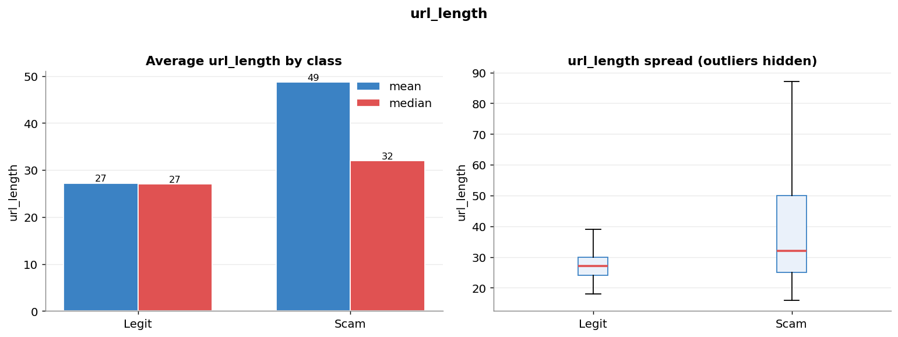

---

## 2. `has_https`

**Hypothesis:** Legitimate sites almost always use HTTPS; scam links more often skip it.

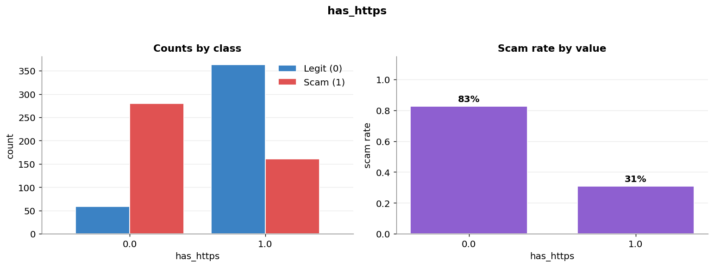

---

## 3. `num_subdomains`

**Hypothesis:** Phishing links often stack more sub-domains to look legitimate (e.g. `secure.login.charity.example.com`).

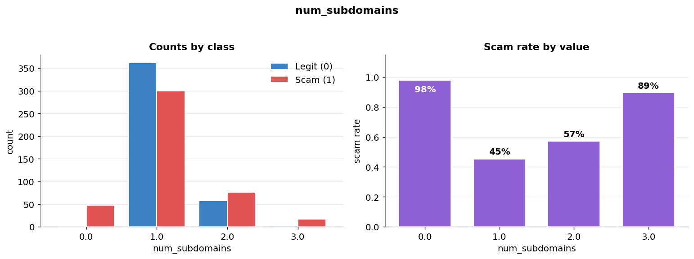

---

## 4. `tld_length` *(experimental feature)*

**What it is:** The length of the TLD — the last part of the host. `.com` = 3, `.uk` = 2, `.host` = 4, `.online` = 6.

**Hypothesis:** Scammers sometimes use unusual long TLDs (`.online`, `.click`, `.support`) or cheap country codes. This checks whether TLD length differs between legit and scam. It is a richer version of `two_letter_tld` — instead of just "is it 2 letters?", it measures the actual length.

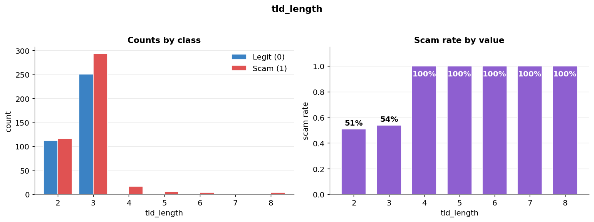

---

## 5. `two_letter_tld` *(experimental feature / self-test)*

**What it is:** Turns the `\.[a-zA-Z]{2}\b` regex into a 0/1 feature and tests it across the **whole** dataset (rather than only inside the "yes" group).

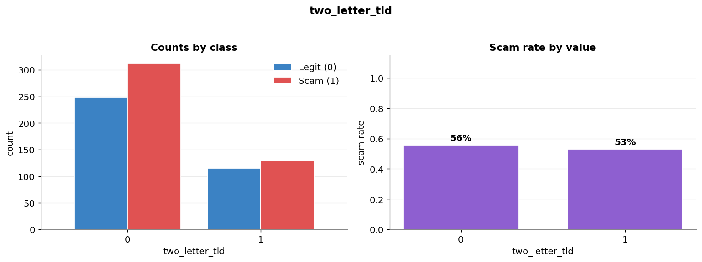

---

## 6. `special_character_count`

**Hypothesis:** Scam URLs are packed with special characters — dashes, digits, `%`, `@`, slashes. If so, the average count should be higher for scam links. Shown as an average comparison plus a box plot with outliers hidden.

---

## 7. `suspicious_keyword_count`

**Hypothesis:** Scam URLs more often contain words like *donate, urgent, verify, login, gift*. Links with one or more suspicious keyword should skew more towards scam.

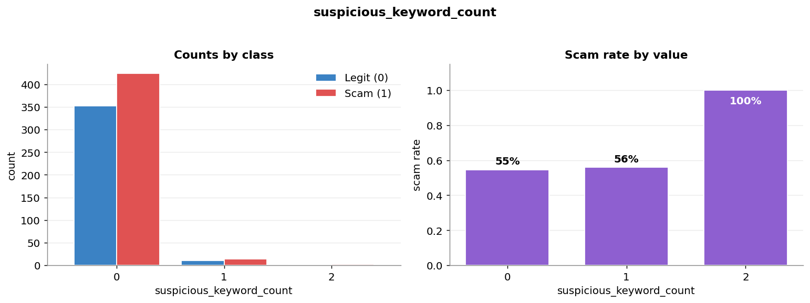

---

## 8. `domain_age_days` *(WHOIS)*

**Hypothesis:** Fraudulent sites are registered days or weeks before a campaign; real charities are years old. The `-1` bucket (WHOIS lookup failed) is shown separately in grey.

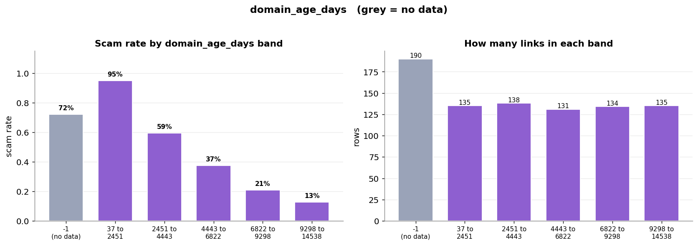

---

## 9. `domain_expiry_days` *(WHOIS)*

**Hypothesis:** Scam domains are registered for the minimum term, so they expire sooner. `-1` = lookup failed.

> **Caveat:** Real values can be negative (an already-expired domain), so `-1` is ambiguous — it could mean "no data" *or* "expired yesterday". This is worth noting as a limitation.

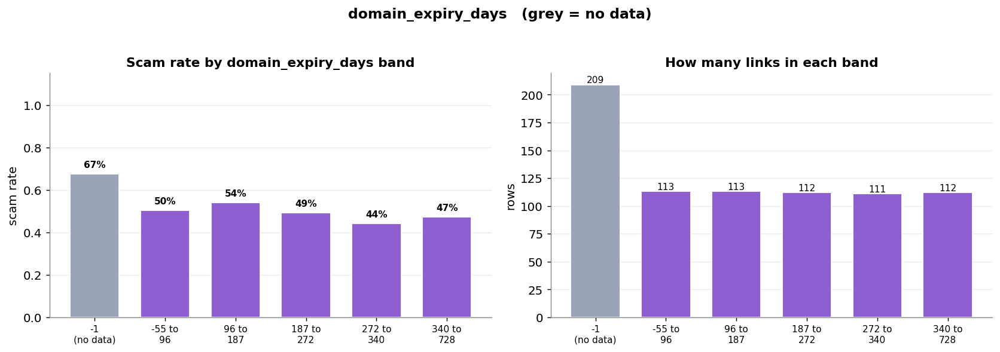

---

## 10. `unknown_registrar`

**Hypothesis:** If WHOIS can't find a registrar at all, the domain is suspicious — free-hosting subdomains (`workers.dev`, `pages.dev`) have no registration record of their own, and scammers use them heavily.

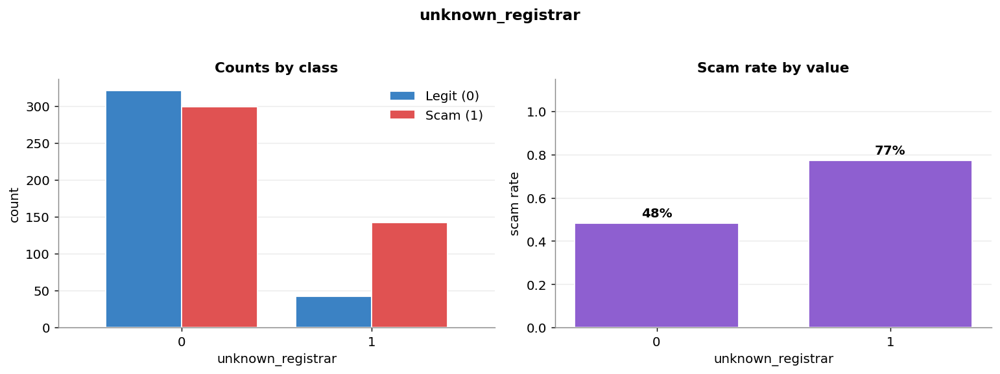

---

## 11. `registrar_phishing_score` *(external data — Cybercrime Information Center)*

**Source:** Interisle / Cybercrime Information Center *Phishing Landscape*, Feb–Apr 2026 registrar tables. The score is phishing domains normalised by domains under management.

**Encoding:** `-2` = no WHOIS data · `-1` = registrar not tracked by CIC · `≥0` = published score.

> **Watch for a U-shape.** Scam rate is high at `-2`, dips for low scores, then climbs again for high scores. A single correlation number reports ≈0 and misses this entirely — but a Decision Tree can split on both arms, so the feature is more useful than its correlation suggests.

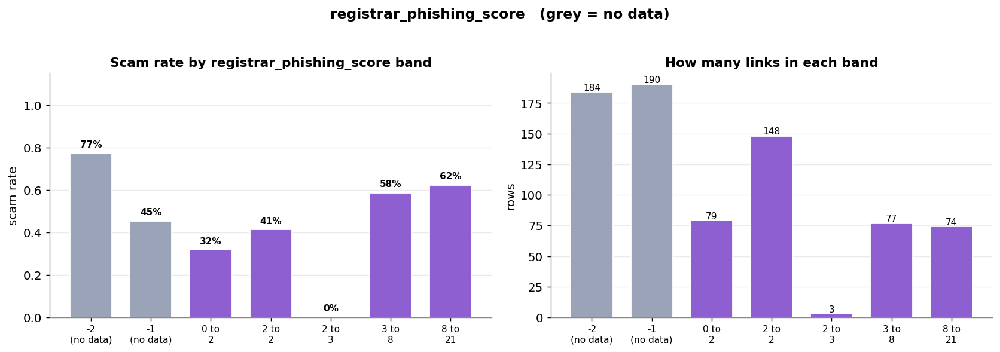

---

## 12. `tld_phishing_score` *(external data — Cybercrime Information Center)*

**Source:** The CIC TLD tables (Feb–Apr 2026). Measures how much phishing is reported on each TLD, normalised by size. `-1` = TLD not in the CIC tables.

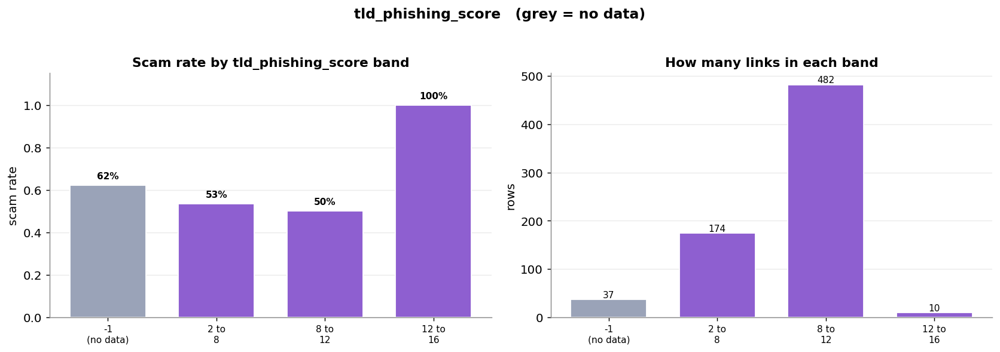

---

## 13. Overall Comparison — Which Features Separate Best?

Correlation of each feature with the label. The longest bar is the strongest *linear* separator.

> **Important caveat:** Correlation only measures straight-line relationships. Features with sentinel values (`domain_age_days`, `registrar_phishing_score`) have **non-linear, U-shaped** patterns that correlation scores near zero — but a Decision Tree can still split on them effectively. Read this chart *alongside* the per-feature scam-rate plots above, not instead of them.

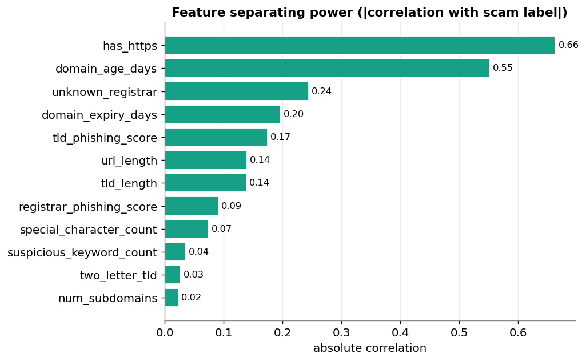
